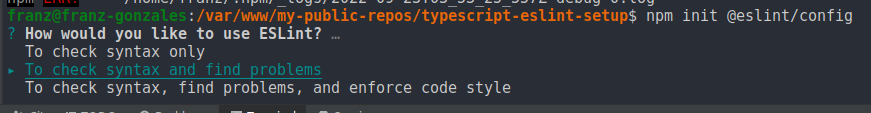
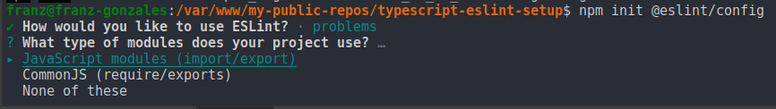
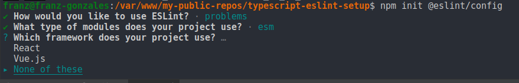
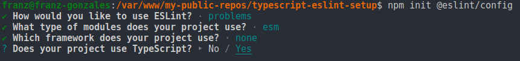
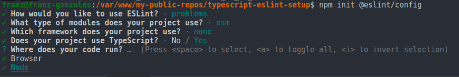
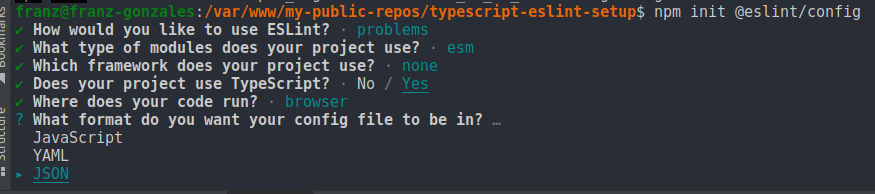
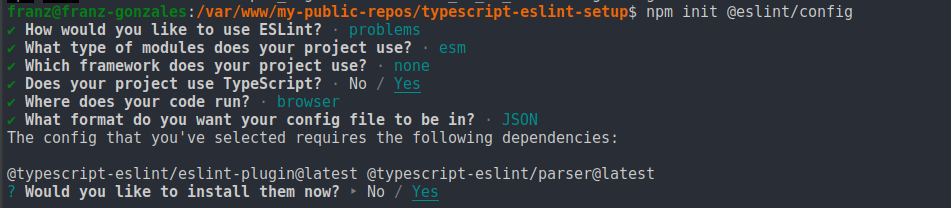

# typescript-eslint-setup

### Instalacion del proyecto de ejemplo
```npm install```

### Instalación de eslint desde cero
```npm init @eslint/config```

##### Pasos recomendados para la instalación








### Configuración<br>

El fichero de configuracion ```.eslintrc.json``` contiene las reglas de eslint:<br>
Configuracion sugerida: 
```
"rules": {
    "semi": ["error", "always"],      
    "no-console": 0,
    "no-tabs": "error",
    "no-mixed-requires":"error",
    "func-call-spacing":"error",
    "no-var": "error",
    "comma-spacing": "error",
    "no-multi-spaces": "error",
    "array-bracket-spacing": ["error", "always"],
    "key-spacing": "error",
    "no-unused-vars": "off",
    "indent": ["error", 2],    
    "object-curly-spacing": ["error", "always"],        
    "padded-blocks": ["error", { "blocks": "never", "classes": "always", "switches": "never" }],
    "space-before-blocks": "error",
    "no-constant-condition": "off",
    "eol-last": ["error", "always"],
    "@typescript-eslint/no-explicit-any": "off",
    "@typescript-eslint/quotes": [ 2, "single", "avoid-escape" ]
}
```
ver mas en [https://eslint.org/docs/latest/user-guide/configuring/](https://eslint.org/docs/latest/user-guide/configuring/)

Nota: <br>
Para realizar una revision de la sintaxis segun las reglas configuradas se puede ejecutar el comando:<br>
```npx eslint .```<br>
Algunos problemas informados por las reglas definidas se pueden solucionar automáticamente mediante la opción --fix:<br>
```npx eslint --fix .```

ver mas en [https://eslint.org/docs/latest/user-guide/command-line-interface](https://eslint.org/docs/latest/user-guide/command-line-interface)